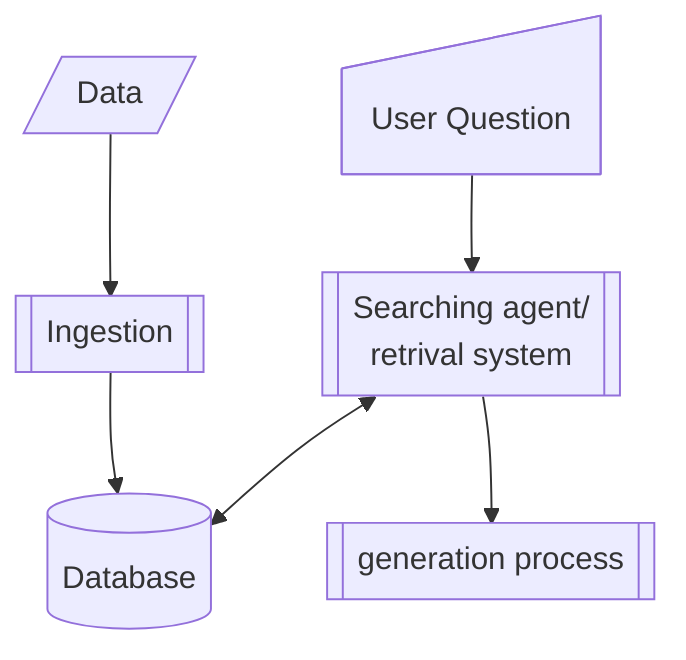

# RAG overview

The very high level overview (that makes something not at all simple look simple)

In the following sections we will go into detail on each of the processes, 
including the important preparation of input data, that are just presented 
assumed present in the above diagram.

- [Datapreparation](rag/datapreparation.md)
- [Ingestion](rag/ingestion.md)
- [Searching agent/retrival system](rag/retrival_system.md)
- [Generation process](rag/gen_process.md)

## Important possible additions

### Varification
In addition to this there could/should also be an answer verification process
with a final verification of the provided answer, that it is truthfull according 
to the retrieved information.

### User input splitting

Tests whether the user question/mesagges actually request info? If so, on one or more area?

Additionally, based on the knowledge of the knowledge base, would a single area of interest from the user actually 
require multiple queries?

Loop over each of these derived queries.

#TODO: Add examples of splitting user input in the retrieval sub process and collecting all retrieved material for one
answer generation call versus looping over the various parts of a user message generating answers for each part 
separately and then collecting them in one answer at the end.