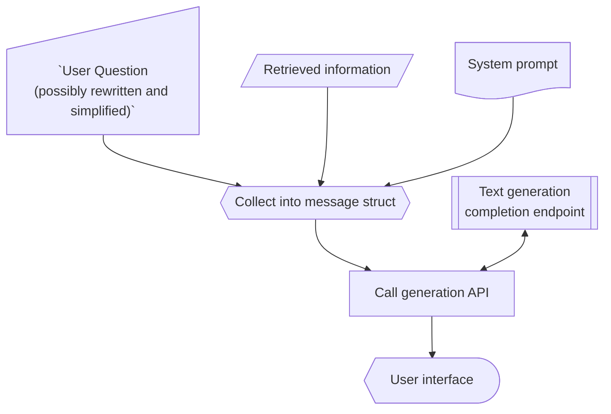

# Response generation using large language models

The simplest part of a RAG system is the generation of the response.

When information/context have been retrieved, the system prompt together with the user question are combined and 
passed to the text generation API. 

Notice that the user question needs not be the actual message the user wrote to the system, it might represent a part 
of it and a more focused/lean version of it.

if this is just part of a loop to collect answers that should be combined into a complete response, then the response 
(and possibly request) needs to be passed on to a process/agent that collects information from all iterations. 