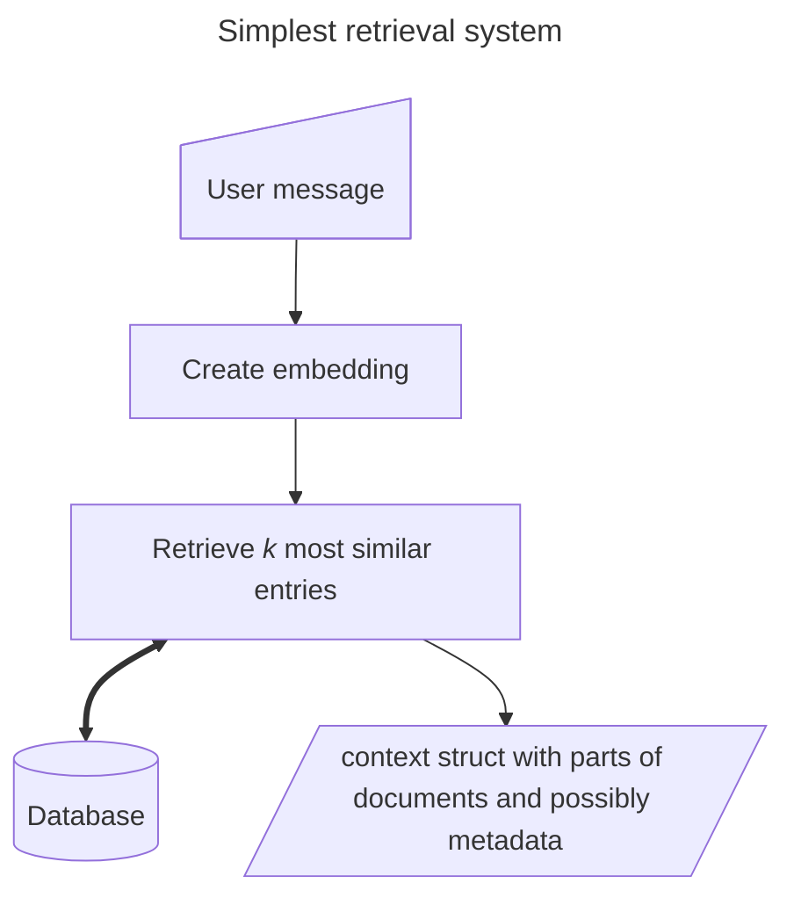
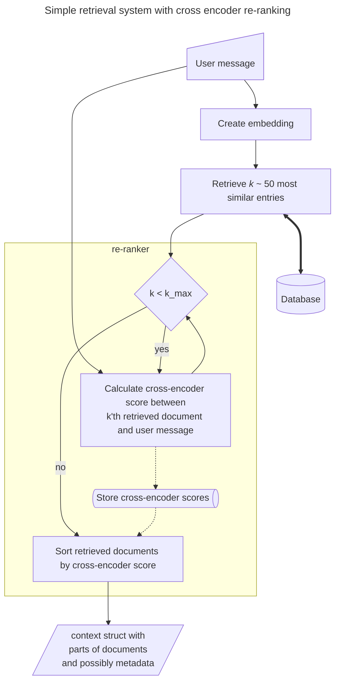

# Information retrieval system

Together with the [data ingestion pipeline](./ingestion.md) the retrival system constitute the two chambers of the heart 
of a RAG system.

The retrival system is responsible for retrieving relevant context from the knowledge base, that the ingestion system
has constructed.

The retrival system can be very simple, like:


where the embedding could be a semantic embedding (aka dense embedding), a sparse BM25 embedding or something along 
those lines and were _k_ is on the order of 3-5.

This can be extended by a re-ranking process. Which can be done using a dedicated cross-encoder model 

or by asking a generative model to sort (portions of) the retrieved documents or simpler just to indicate whether a 
document is relevant or not. That is the cross-encoder process from the above diagram can be replaced by something like:
```mermaid
---
title: Alternative genLLM based re-ranking sub process
---
graph TD; 
    E[]:::empty
    EE[]:::empty
    classDef empty height: 0, width: 0

    E -- retrieved docs --> loopCondition
    EE -- user msg --> promptConstructor
    
    loopCondition@{ shape: decision, label: "k &lt; k_max"
    prompt@{ shape: doc, label: "System prompt" }
    promptConstructor@{ shape: hex, label: "Construct the prompt" }
    caller@{ shape: process, label: "Call generation API" }
    genai@{ shape: subproc, label: "Text generation
    completion endpoint" }
    storage@{ shape: das, label: "Store ids for relevant docs"}
    output@{ shape: in-out, label: "output" }
    
    loopCondition -- yes --> promptConstructor
    promptConstructor --> caller
    caller <==> genai
    caller --> loopCondition
    caller -.-> storage
    
    loopCondition -- no ---> output
    
    storage -.-> output
```
the prompt could be something like:
```yaml
messages:
  - role: system
    content: |
      Du vurdere om et givent tekststykke indeholder information der er relevant i forhold til at svare på et bruger 
      spørgsmål. Svar i JSON format: {\"reason\": \"string\", \"relevant\": bool}. ALLE begrundelser skal være på dansk.
  - role: user
    content: |
      <bruger spørgsmål>
      {{ user_question }}
      </bruger spørgsmål>
      
      <tekststykke>
      {{ retrieved_doc }}
      </tekststykke>
```
Here the prompt is written using a message format, where the role is specified. And `user_question` and `retrieved_doc` 
are variables that are replaced in the prompt construction process.  
NB: This is just an example. Probably the prompt should include examples, that is, say three message turns between 
"user" and "assistant" (placed between the system message and the final user message where the content is set by the 
variables), where examples of user questions and corresponding relevant or non-relevant documents are shown and how the 
LLM is expected to answer that message. In my experience this also helps smaller generative LLMs to be more consistent in
following the json-output format. The examples might even be dynamically chosen from a longer list of examples.
More detailed instructions or information on the context of the questions and knowledge base might also be advantages.  

#TODO examples of prompts in jinja2


_Note_: For english language solutions or other high ressource languages another retrival issue becomes relatively 
relevant, that is ow to search a 
vector index space. This is usually done using approximate algorithms to estimate cosine-similarities, but can also 
(in principle) be brute force calculated. 
Thus, it is a fact that the approximate algorithms add an error on the 
retrieval process, but especially in low-resource languages like Danish, it is a much bigger issue how the embedding is
done and how the document chunking/embedding context is constructed. Thus, that is the focus for this documentation.
The aspect of vector space search will not be covered anymore here.

## Training or generel semantic embedding models

The semantic embedding models can be choosen from off-the-shelf models or trained/fine-tuned.
Off the shelf models can be proportary models like openAIs embedding endpoint or locally hosted open weights models. 

#TODO add examples